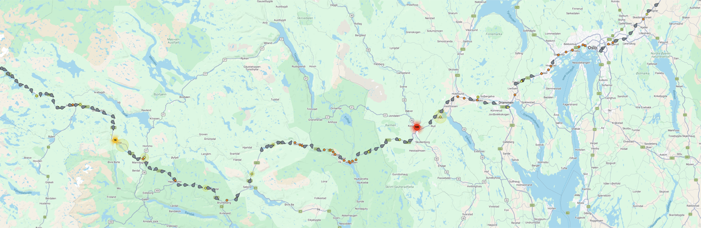
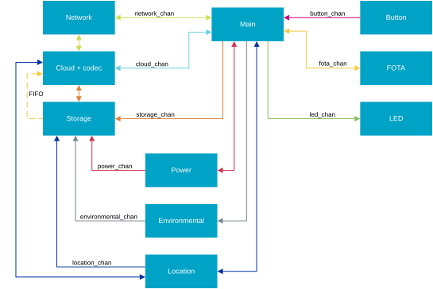

# Asset Tracker Template

[](https://github.com/nrfconnect/Asset-Tracker-Template/releases)
[](https://sonarcloud.io/dashboard?id=nrfconnect-asset-tracker-template)
[](https://sonarcloud.io/dashboard?id=nrfconnect-asset-tracker-template)
[](https://github.com/nrfconnect/Asset-Tracker-Template/actions/workflows/build-and-target-test.yml?query=branch%3Amain+event%3Apush)
[](https://github.com/nrfconnect/Asset-Tracker-Template/actions/workflows/build-and-target-test.yml?query=branch%3Amain+event%3Aschedule)
[](https://nrfconnect.github.io/Asset-Tracker-Template/power_measurements_plot.html)
[](https://nrfconnect.github.io/Asset-Tracker-Template/ram_memory_view.html)
[](https://nrfconnect.github.io/Asset-Tracker-Template/flash_memory_view.html)

## Overview

The Asset Tracker Template is a modular framework for developing IoT applications on nRF91-based devices.
It is built on the [nRF Connect SDK](https://www.nordicsemi.com/Products/Development-software/nRF-Connect-SDK) and [Zephyr RTOS](https://docs.zephyrproject.org/latest/), and provides a modular, event-driven architecture suitable for battery-powered IoT use cases.
The framework supports features such as cloud connectivity, location tracking, and sensor data collection.

The system is organized into modules, each responsible for a specific functionality, such as managing network connectivity, handling cloud communication, or collecting environmental data.
Modules communicate through [zbus](https://docs.zephyrproject.org/latest/services/zbus/index.html) channels, ensuring loose coupling and maintainability.

**Supported hardware**:

- [Thingy:91](https://www.nordicsemi.com/Products/Development-hardware/Thingy-91) (nRF9160)

If you are new to nRF91 series and cellular IoT, consider taking the [Nordic Developer Academy Cellular Fundamentals Course](https://academy.nordicsemi.com/courses/cellular-iot-fundamentals).

<p align="center">
  
  <br>
  <em>Thingy:91 X reporting its location to nRF Cloud running the Asset Tracker Template</em>
</p>

---

## Get started

### Prerequisites

Install the nRF Connect SDK toolchain (v3.4.0 or later):

```bash
nrfutil install sdk-manager
nrfutil sdk-manager install v3.4.0
```

### Clone and build

```bash
# Initialize the west workspace using this repo as the manifest
west init -m https://github.com/samo4/ninja.git --mr main workspace

cd workspace

# Pull in the nRF Connect SDK modules
west update

# Build for your target
cd app
west build -b thingy91x/nrf9151/ns   # Thingy:91 X
# or
west build -b nrf9151dk/nrf9151/ns   # nRF9151 DK
# or
west build -b thingy91/nrf9160/ns
```

See the [Getting Started](docs/common/getting_started.md) guide for detailed instructions on flashing, connecting to nRF Cloud, and testing.

---

## Fork changes

This repository is a fork of the [nRF Asset Tracker Template](https://github.com/nrfconnect/Asset-Tracker-Template), adapted for the original **Thingy:91 (nRF9160)** with significant trimming of features not needed for this project.

### Supported hardware

- **Thingy:91** (nRF9160) — original model, not Thingy:91 X

### Changes from upstream

| Change                                                                                                                                   | Files                                                                                                                |
| ---------------------------------------------------------------------------------------------------------------------------------------- | -------------------------------------------------------------------------------------------------------------------- |
| **Switch to Thingy:91 (nRF9160)** — added board-specific config and overlay for the original Thingy:91 with nRF9160 SiP                  | `app/boards/thingy91_nrf9160_ns.conf`, `app/boards/thingy91_nrf9160_ns.overlay`                                      |
| **Remove MCUboot** — no OTA/bootloader needed; TF-M boots directly at 0x0, application at 0x10000                                        | `app/Kconfig.sysbuild`, `app/prj.conf`, `app/boards/thingy91_nrf9160_ns.conf`                                        |
| **Remove FOTA** — stripped firmware-over-the-air module, downloader, and all associated Kconfig                                          | `app/prj.conf`, `app/src/main.c` (FOTA includes, channel, states, handlers removed), `app/sysbuild/mcuboot/prj.conf` |
| **Remove Memfault** — stripped cloud crash-reporting and metrics entirely                                                                | `app/prj.conf` (all `CONFIG_MEMFAULT_*` removed)                                                                     |
| **Remove MQTT example** — deleted the MQTT cloud module example code                                                                     | `examples/modules/cloud/` (entire directory deleted)                                                                 |
| **Simplify sysbuild** — removed b0/NSIB `merged.hex` dependency; image merge only when b0 target exists                                  | `app/sysbuild.cmake`                                                                                                 |
| **Simplify flash layout** — reclaimed MCUboot, secondary-slot, and scratch partitions (968 KB for application code)                      | `app/boards/thingy91_nrf9160_ns.overlay` (partition overrides)                                                       |
| **SPU alignment** — non-secure start address aligned to nRF9160 SPU region boundary (32 KB)                                              | `app/boards/thingy91_nrf9160_ns.overlay`                                                                             |
| **Update SDK version** — from `v3.4.0-rc2` to stable `v3.4.0` (LTS)                                                                      | `west.yml`                                                                                                           |
| **Enable RTT console** — replaced UART (dead on Thingy:91 via nRF52840) with J-Link RTT                                                  | `app/boards/thingy91_nrf9160_ns.conf`                                                                                |
| **Fix FOTA flash page size** — replaced hardcoded `CONFIG_SPI_NOR_FLASH_LAYOUT_PAGE_SIZE` with runtime flash API                         | `app/src/modules/fota/fota.c`                                                                                        |
| **Reduce MCUboot size** — minimized stack, removed serial recovery, disabled multithreading (attempted before removing MCUboot entirely) | `app/sysbuild/mcuboot/prj.conf`                                                                                      |

### Flashing

```bash
# Build
cd app
west build -b thingy91/nrf9160/ns

# Flash TF-M + application merged image
west flash --erase --no-rebuild --hex-file build/app/zephyr/tfm_merged.hex
```

### Serial output

RTT is enabled (via J-Link):

```bash
JLinkRTTLogger -device nRF9160_xxAA -if SWD -speed 4000 -RTTAddress Auto
```

---

## Documentation

<table>
  <tr>
    <td><a href="docs/common/getting_started.md">Getting Started</a></td>
    <td><a href="docs/common/architecture.md">Architecture</a></td>
    <td><a href="docs/common/configuration.md">Configuration</a></td>
  </tr>
  <tr>
    <td><a href="docs/common/modifying.md">Modifying</a></td>
    <td><a href="docs/modules/overview_modules.md">Modules</a></td>
    <td><a href="docs/common/connecting.md">Connecting</a></td>
  </tr>
  <tr>
    <td><a href="docs/common/location_services.md">Location Services</a></td>
    <td><a href="docs/common/low_power.md">Achieving Low Power</a></td>
    <td><a href="docs/common/fota.md">Firmware Updates (FOTA)</a></td>
  </tr>
  <tr>
    <td><a href="docs/common/test_and_ci_setup.md">Testing and CI Setup</a></td>
    <td><a href="docs/common/tooling_troubleshooting.md">Tooling and Troubleshooting</a></td>
    <td><a href="docs/common/known_issues.md">Known Issues</a></td>
  </tr>
  <tr>
    <td><a href="docs/common/release.md">Release Artifacts</a></td>
    <td><a href="docs/common/release_notes.md">Release Notes</a></td>
    <td></td>
  </tr>
</table>

---

## System Overview



Core modules include:

- **[Main](docs/modules/main.md)**: Implements the business logic and controls the overall application behavior.
- **[Storage](docs/modules/storage.md)**: Stores data from enabled modules.
- **[Network](docs/modules/network.md)**: Manages LTE connectivity and tracks network status.
- **[Cloud](docs/modules/cloud.md)**: Handles communication with nRF Cloud using CoAP.
- **[Location](docs/modules/location.md)**: Provides location services using GNSS, Wi-Fi, and cellular positioning.
- **[Button](docs/modules/button.md)**: Reports button press events for user input.
- **[FOTA](docs/modules/fota_module.md)**: Manages firmware over-the-air updates.

Thingy:91 X specific modules:

- **[Environmental](docs/modules/environmental.md)**: Collects environmental sensor data (temperature, humidity, pressure).
- **[LED](docs/modules/led.md)**: Controls an RGB LED for visual indication.
- **[Power](docs/modules/power.md)**: Monitors battery status and provides power management.
- **[UART Power Control](docs/modules/uart_power_control.md)**: UART suspend/resume on VBUS changes.

### Key Features

- **State Machine Framework (SMF)**: Predictable behavior with run-to-completion model
- **Message-Based Communication**: Loose coupling via [zbus](https://docs.nordicsemi.com/bundle/ncs-latest/page/zephyr/services/zbus/index.html) channels
- **Modular Architecture**: Separation of concerns with dedicated threads for blocking operations
- **Power Optimization**: LTE PSM enabled by default with configurable power-saving features
